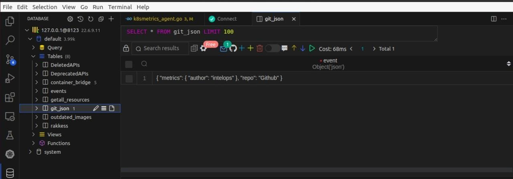
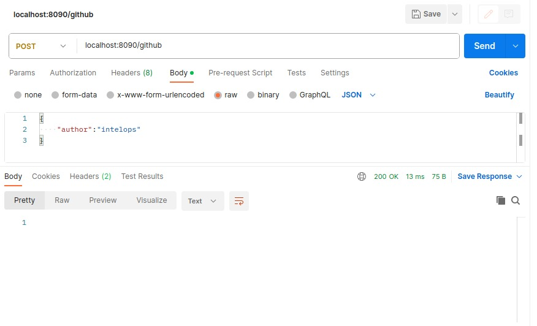
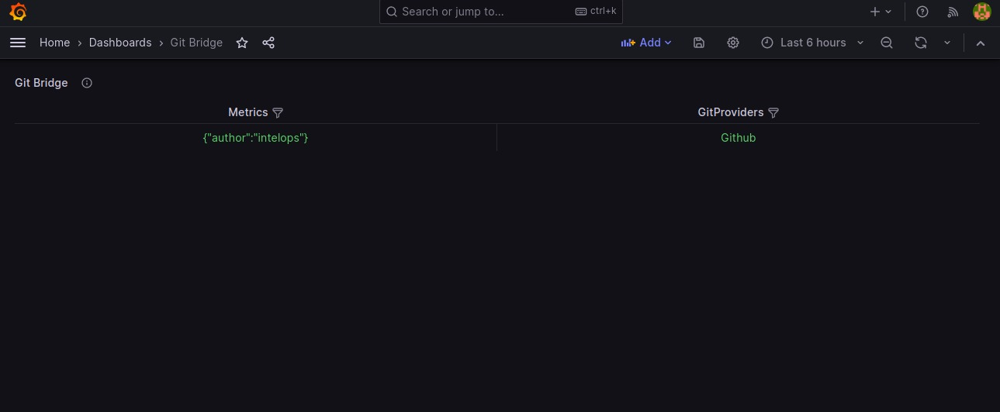

# Contribution Guidelines

- [Introduction](#introduction)
- [Reporting Issues](#reporting-issues)
- [Feature Requests](#feature-requests)
- [Contribute code](#contribute-code)
- [Conduct](#conduct)


## Introduction

The goal of this document is to provide an overview of how you can get involved in KubViz.

As a potential contributor, your changes and ideas are welcome at any hour of the day or night, on weekdays, weekends, and holidays. Please do not ever hesitate to ask a question or send a pull request.

If you are unsure, just ask or submit the issue or pull request anyways. You won't be yelled at for giving it your best effort.

## Reporting Issues

If you find a bug while working with the KubViz, please [open an issue on GitHub](https://github.com/intelops/kubviz/issues) and let us know what went wrong. We will try to fix it as quickly as we can.

## Feature Requests

You are more than welcome to open issues in this project to [suggest new features](https://github.com/intelops/kubviz/issues).


## Contribute code

### Dependencies

You need 

<a href="https://go.dev/doc/install" target="_blank">`Go 1.16+`</a>

<a href="https://docs.docker.com/engine/install/" target="_blank">`Docker`</a>

<a href="https://docs.docker.com/compose/install/standalone/" target="_blank">`Docker Compose`</a>

It is possible to develop kubviz on Windows, but please be aware that all guides assume a Unix shell like bash or zsh.

Clone Kubviz and run it in Docker

```bash
git clone https://github.com/intelops/kubviz.git

cd kubviz
```

When we are running the kubviz outside of cluster(locally) we need to provide the cluster config to it.

To provide the cluster config:

Add your cluster config to quickstart/config file

```bash
docker-compose -f quickstart.yml up --build --force-recreate
```

This might take a minute or two. Once the output slows down and logs indicate a healthy system you're ready to roll!

A healthy system will show something along the lines of (the order of messages might be reversed):



**NOTE**

There are two important factors to get a fully functional system:

* You need to make sure that ports 8123, 5000, 5001, 9000, 8222, 4222, 3000, 8090, and 8091 are free

* Clickhouse Database is used in this example. Kubviz supports clickhouse as database backends. For the quickstart, we're mounting a persistent volume to store the clickhouse database in.

### Network architecture

**Git Repository Tracking Agent:**

Api port : (port 8090) - This is the available port for us to send payload to git agent

**kubviz Agent:** This agent does not expose any port at the moment.

**Container Registry Tracking Agent:**

Api port: (port 8091) - This is the available port for us and this port is already configured docker-registry which we are 

running locally for the testing

**Grafana:**
This service is available at the port 3000

Once all the services comes up:

open postman

send a sample json to localhost:8090/github

```bash
{
    "author":"intelops"
}
```


This will populate the git_json table



To populate the container_bridge table follow these steps

```bash
docker pull ubuntu:latest

docker tag ubuntu:latest localhost:5001/ubuntu:v1

docker push localhost:5001/ubuntu:v1
```


## Conduct

Whether you are a regular contributor or a newcomer, we care about making this
community a safe place for you and we've got your back.

[KubViz Community Code of Conduct](https://github.com/intelops/kubviz/blob/main/CODE_OF_CONDUCT.md)

We welcome discussion about creating a welcoming, safe, and productive
environment for the community. If you have any questions, feedback, or concerns
[please let us know](https://intelops.ai/).